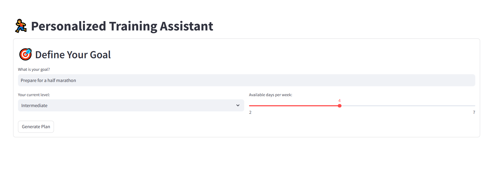

# Stop Using Generic Training Plans. Your Garmin Data Holds the Key to Your Next Personal Best.



Are you a runner tired of one-size-fits-all training schedules? Do you have years of valuable performance data locked away in your Garmin Connect account?

This project transforms that data into your ultimate competitive advantage. We've built a **Personalized Training Assistant** that acts as your personal AI running coach, crafting the perfect half-marathon plan tailored specifically to *you*.

## Features

- **Data Import:**
  - Supports CSV and TCX files exported from Garmin Connect.
  - Reads and processes sports activity data.

- **Exploratory Analysis:**
  - Generates detailed analyses of completed runs.
  - Provides performance statistics, progress, and training patterns.

- **Training Planning:**
  - Automatically generates complete training plans for half marathons.
  - Customizes plans based on the athlete's history.

- **Export and Integration:**
  - Exports plans and analyses in easy-to-read formats.
  - Integrates with platforms such as SisRun.

## Project Structure

```
├── detailed_run_analysis.txt           # Detailed running analysis report
├── garmin_activities.csv               # Raw data exported from Garmin Connect
├── connection_and_exploration.ipynb    # Data exploration and connection notebook
├── garmin_training_20250222.tcx        # Example TCX training file
├── requirements.txt                    # Project dependencies
└── src/
  ├── garmin_activities.csv           # Internal copy of activity data
  ├── garmin_connect.py               # Garmin data connection and reading module
  ├── generate_full_plan.py           # Complete training plan generation
  ├── main.py                         # Main execution script
  ├── half_marathon_full_plan.txt     # Example generated plan
  ├── sisrun_export.py                # SisRun export module
  └── training_agent.py               # Training analysis and planning logic
```

## How to Use

1. **Install dependencies:**
   ```bash
   pip install -r requirements.txt
   ```
2. **Run the main script:**
   ```bash
   python src/main.py
   ```
3. **Explore the results:**
   - Generated reports and plans will be available in the output files.
   - Use the notebook for additional exploratory analysis.

## Technologies Used
- Python 3
- Pandas, Numpy
- Jupyter Notebook
- Libraries for handling TCX/CSV files

## Possible Extensions
- Support for other sports and platforms
- Interactive data visualizations
- Generation of plans for different distances


## Author
- Diego Simão

---

This project demonstrates skills in sports data analysis, automated training planning, and integration of different data formats, making it ideal for a Data Science and Data Engineering portfolio.
